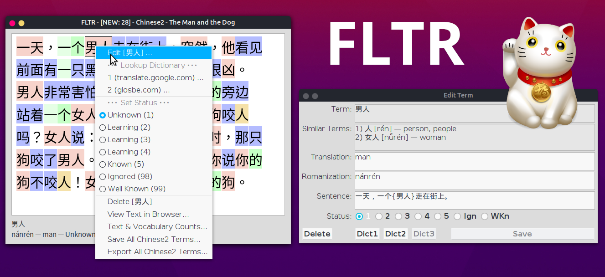

# FLTR: Foreign Language Text Reader

## This is the Official FLTR Version 1.4.1 (October 17 2025)



## About FLTR

FLTR (Foreign Language Text Reader) helps you do both extensive and intensive reading as part of your foreign language acquisition in an easy and pleasant way.

While reading, you look up unknown words in web dictionaries (online) or locally installed dictionary applications, save vocabulary terms with translations, and track your learning progress. Each term has a learning status (1/"Unknown" to 5/"Known", plus "Ignored" and "Well Known") with associated colors.

## Setup Instructions

### Installation from the sources (Linux)

You'll need an installed JDK (Java Development Kit).

Compile the source code and create the JAR "fltr.jar":

   ```
   ./COMPILE.sh
   ```

### Running the Application

You'll need an installed JRE (Java Runtime Engine) and the file "fltr.jar".

   ```
   java -jar fltr.jar
   ```

## Please read more:

- [FLTR Documentation](https://hapepo23.github.io/fltr/FLTR_Documentation.pdf)
- [MIT License](LICENSE)

## Download

- [Latest release](https://sourceforge.net/projects/foreign-language-text-reader/files)

-----

### Security Notice

The code I released here may appear in third-party projects. I do not maintain, endorse, or have any affiliation with such projects. Any malicious or deceptive use is unauthorized and should be reported to the hosting platform.

-----